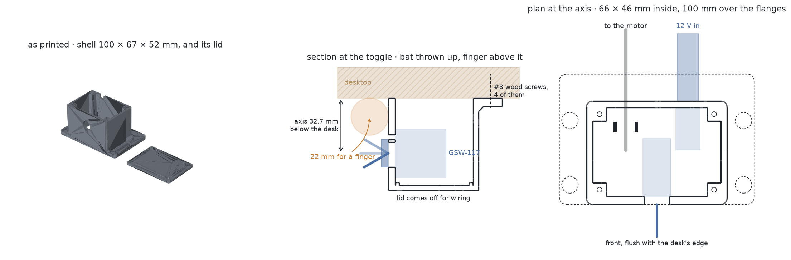

# printables

Parametric 3D-printable models for a Bambu Lab P2S, written in
[build123d](https://build123d.readthedocs.io/) and sliced without opening the
slicer.

Every model here is a Python function from a frozen `Params` dataclass to a
solid. The parameters are the design — the sliders a GUI would expose — and
each one carries a `validate()` that refuses the combinations that are
physically impossible rather than quietly producing a part that cannot print.
The tests assert design intent, not geometry hashes: that a rim is the highest
thing on a coin, that nothing in a clip overhangs more than 45 degrees, that a
mounting pad leaves an adhesive strip's pull tab clear, that a bag holder's
funnel never once widens on the way down.

## What's in it

### Poop bag holder


A doo loop: a collar at the top that the lead's handle threads through, a wide
opening under it, and that opening funnelled down into a narrow throat. Push
the tied handles through the opening, pull down, and they wedge where the
funnel gets to their size. There is no hook, no gate and no catch in it
anywhere, and nothing to buy.

Retention is that the aperture is *closed*. It is a hole, not a hook, so
nothing in it can fall out however hard the lead is swung, and the bag comes
off the way it went on. A hook has to be either easy to load or hard to unload;
a closed hole is both, because the direction that gets a bag in is a direction
gravity never pushes it. What the funnel adds is that you do not have to aim:
anything landed anywhere in the opening is walked down to the throat by pulling
on it, and a 26mm bundle stops 7mm below the belly where a 9mm bundle stops 20.

```sh
python -m tools.bag_holder
python -m tools.bag_holder --strap wide --slot 4 --copies 2
```

The collar turns. It is a second body printed inside its own socket in the same
go, held there because both it and the socket swell at mid height, so its
widest is wider than either end of the hole it sits in and it cannot be lifted
out — the fidget's trick, revolved rather than stacked, because unlike a ring
of nested monotiles this one is round. The gap between them is exactly the same
at every height, which is what decides whether a print-in-place joint comes off
the plate turning or comes off fused. It earns its place: the funnel only works
pointing up, and a collar clamped round webbing points wherever the webbing
does. One turning joint and the collar goes where the lead puts it while the
body hangs off it plumb.

Everything but the swivel is a profile extruded straight up. The ribbon is the
aperture offset outward by one wall, which is how a wire form is made; the hole
it leaves is a chain of five circles and the tangent hulls between them, so
there is no corner in it for a thin plastic handle to snag on, bar two that
turn inward and are filleted instead. Both ends of the section are broken, so
the ribbon is an octagon rather than a rectangle with two corners off it — cut
as a stack of insets a layer high rather than as chamfers, because the unions
that build the aperture leave seams a few thousandths of a millimetre long and
no chamfer will run across one.

Nothing overhangs past 45°, and the test knows exactly what does: every sloped
facet in either body is within half a degree of one of three angles — the
collar's underside at 27°, the socket's roof at 32°, or a break at 45. Those
first two are the same cone seen from opposite sides, because the collar's
upper half faces the sky while the socket is a cavity closing in over itself.

Five of the numbers here came off prints rather than out of the arithmetic. It
was twice as thick as it needed to be. The collar's slot wanted half again in
each direction before a folded handle would work through it easily. A rule
saying the throat had to be deeper than it was wide turned out to be wrong — a
5mm throat grips fine in 4mm of depth. Breaking the top edge alone still felt
sharp, so both ends are broken now. And the swivel turned stiffly, which came
down to a chamfer cut into a rim that was already tapering, a socket that was
not broken where its collar was, and a swell steep enough to print rough on the
one face that has to slide.

### Plant clip


An adhesive pad with a C that a vine presses into. Built around a 3M Command
strip rather than a screw, sized for pothos and hoya — roughly 4 to 12mm of
stem — and printed pad-down so the adhesive gets the smooth build-plate face.
The mouth faces away from the wall because that is the only direction that both
prints and installs, and the wrap is capped at 270° because past that the arm
tips lean more than 45° off vertical.

```sh
python -m tools.plant_clip --set --copies 3      # one plate, four sizes, twelve clips
python -m tools.plant_clip --stem 9 --strip medium --count 2
```

A clip holds a band of stem diameters a couple of millimetres wide — from its
mouth, the smallest stem that stays captive, up to its bore, the largest that
fits. `--set` prints the four sizes that tile the range between them.

### Desk switch box



A box for a Gardner Bender GSW-117 toggle that screws to the underside of a
sit-stand desk at its front edge, with a 5.5 × 2.1mm DC jack and a tied-down
lead to a Greartisan 12V gearmotor out of the back. The bat throws up and
down, because "up for up" is the one mapping that needs no label -- and that
is what sets the box's height. Sending the desk down means a finger between
the handle and the desk, so the toggle's axis sits a finger's thickness below
the desktop plus however far the bat's tip rises when it is thrown, and the
box is exactly as tall as it takes to get the switch body in under that.

```sh
python -m tools.desk_switch
python -m tools.desk_switch --finger 25 --jack-hole 11.5
python -m tools.desk_switch --switch gsw-123 --mirror
```

The switch is a 20 A heavy-duty toggle with a spring that fights back, and
the box is built for it: the load is along the throw, in the plane of a 4mm
front wall, and the box hangs off three flanges and four wood screws with a
45° gusset under each so nothing can hinge. Print it with six wall loops so
the plastic under the nut is solid rather than two skins over infill, and in
ASA, because a nut torqued onto PLA has crept loose by the end of a summer.

Two parts, no supports. The shell prints rim-down, so the flanges are the
first layer; every hole in a wall is a teardrop with its point away from the
plate and a 2mm flat across the tip that the nut and washer cover. The lid
prints face-down with 45° countersinks, locates in the shell on a lip, and
screws into the corner posts, so wiring never means unscrewing the box from
the desk. The tests put the hardware in as solids -- bushing, body, nut, jack,
a finger-thick cylinder lying along the desk -- and assert that nothing
touches anything it should not.

One thing to know before wiring: the GSW-117 is SPDT, (on)-off-(on), which can
switch a motor on from either throw but cannot reverse it. Up *and* down from
one bat wants the DPDT GSW-123, which is the same body in the same hole -- the
box fits either -- wired as the usual reversing cross; the tool's docstring has
it.

### Commemorative coin


A disc, a rim, and a mark on each face, from one revolved profile. Marks are
text, an SVG, an arched legend, or a drawn stroke, all specified in fractions
of the field so a test print at 80% is the same coin rather than a differently
proportioned one. The obverse is struck in relief inside a recessed field and
the reverse is engraved into a flat underside, because on an FDM printer only
the top face can carry relief without printing over air.

```sh
python -m tools.coin --obverse 2026 --legend "SONNEBORN" --exergue "+++"
python -m tools.coin --part parts.tremblant_coin --scale 0.8 --nozzle 0.2
```

### Einstein monotile fidget


Nested print-in-place rings following the outline of the
[hat aperiodic monotile](https://arxiv.org/abs/2303.10798) (Smith, Myers,
Kaplan & Goodman-Strauss, 2023), derived from its kite grid in `geom/hat.py`.
The walls bulge at mid height so the rings travel a fixed distance and then
wedge, which is what makes it a fidget rather than a pile of loose rings. Adding
rings turns the same part into a coaster.

## Layout

| | |
|---|---|
| `geom/` | Reusable primitives: the monotile, motifs (text, SVG, legends, strokes), the Command strip and lead webbing catalogues |
| `parts/` | One module per model — `Params`, `validate()`, `build()` — plus modules that ship a specific configured instance |
| `tools/` | Command line for each part, and matplotlib previews that need no GPU |
| `p2s/` | The printer: profiles read from the installed Bambu Studio, what filament is on the shelf, and headless slicing |
| `tests/` | Design intent, asserted against the built solid |

## Slicing

`p2s/profiles.py` reads Bambu Studio's own bundled presets and flattens their
`inherits` chains, so the bed size, nozzle and process the models are checked
against can never drift from what actually slices. `p2s/slicer.py` writes a
project 3MF with a merged machine + process + filament config embedded the way
Bambu's `--export-settings` writes it, then drives the app headlessly for a time
and filament estimate.

One environment quirk: Bambu Studio has to run in the user's GUI session, so it
is launched through `open` rather than by executing the binary. From a sandboxed
process that fails, which is what `tools/p2s-slice.sh` exists to work around.

```sh
python -m tools.plant_clip --set --copies 3 -o out/clips   # .stl, .3mf and .png
~/bin/p2s-slice out/clips.3mf                              # time and grams
```

## Running it

```sh
uv sync
uv run pytest
uv run python -m tools.plant_clip
```

Needs Python 3.12+ and, for anything that writes a 3MF, Bambu Studio installed
at `/Applications/BambuStudio.app`. The STL is written either way — a missing
slicer is a note, not a failure.

## Licence

Split, because code and geometry are not the same thing:

- **Code** — MIT. See [LICENSE](LICENSE).
- **Models** — CC BY-NC-SA 4.0: the designs, the STL/3MF/STEP they generate,
  and objects printed from them. Attribution and share-alike, and not for
  commercial use, which includes selling prints. See
  [LICENSE-MODELS](LICENSE-MODELS).
