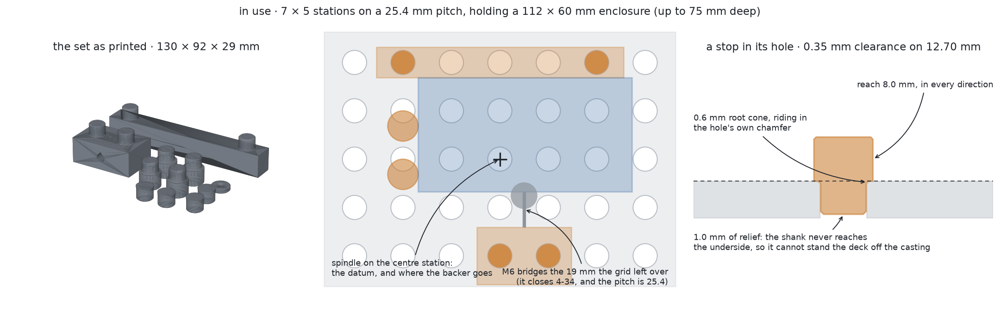

# printables

Parametric 3D-printable models for a Bambu Lab P2S, written in
[build123d](https://build123d.readthedocs.io/) and sliced without opening the
slicer.

Every model here is a Python function from a frozen `Params` dataclass to a
solid. The parameters are the design — the sliders a GUI would expose — and
each one carries a `validate()` that refuses the combinations that are
physically impossible rather than quietly producing a part that cannot print.
The tests assert design intent, not geometry hashes: that a rim is the highest
thing on a coin, that nothing in a clip overhangs more than 45 degrees, that a
mounting pad leaves an adhesive strip's pull tab clear, that a bag holder's
funnel never once widens on the way down.

## What's in it

### Drill press dog set



Workholding for a Craftsman 335.25921 — which is not a drill press but a *stand*
that a portable drill clamps into, with a cast base whose only fixturing is four
T-bolt slots in an X. As a coordinate system that is close to useless, so the
first part is a deck that replaces it: a plate of 12mm holes on a 25mm pitch
that bolts down through those slots once and is never taken off. Then
stops, a fence, a screw clamp, a floating pad and sacrificial backers, all
plugging into the same grid.

```sh
python -m tools.bench_dogs --part strip       # print this first
python -m tools.bench_dogs --part deck
python -m tools.bench_dogs --set
```

The only force worth designing against is torque. Thrust goes straight down into
the deck and needs nothing; a bit grabbing wants to spin the work out of your
fingers, and the whole set exists to route that into the casting through
something that is not your fingers. Work bears on a printed face, the face on a
shank, the shank on the wall of a hole — compression and bearing nearly the
whole way, and no printed threads anywhere.

Nearly, because every shank prints with its layers across its axis, so a side
load bends it at the root in layer-line tension. For a stop taking drill torque
that is nothing. For the clamp it need not be, because the largest force in the
assembly is not the drill — it is the clamp's own screw, and an M6 wound up with
a tool reaches thousands of newtons. So every shank root gets a 45° cone, which
is a fillet in the only direction that still prints, and which costs nothing
because it rides inside the lead-in chamfer already at the mouth of each hole.
And the bolt wants a knob or a wing head, not a hex, so that what a hand can
apply is the limit rather than the plastic being it.

A nicer consequence of the load path than it first looks: a fence and a clamp
holding one workpiece push against each other and both reactions land in the
same plate, so the loop closes inside the deck. The four 5/16-18s into the
casting hold the deck flat and locate it, and that is all they ever do.

#### Why 12 on 25

The grid began as half-inch holes on an inch, reasoning that the machine is
imperial and a ½" Forstner is in every hardware shop in the country. Both halves
were weaker than they sounded. The machine's coupling to imperial is one bolt
size — its slots measure 8.6mm, a round number in neither system — and the grid
doesn't touch that. And no bit is needed to make the printed deck at all; a
wooden one is piloted at 3mm through a printed template and opened out, so bit
size appears in exactly one place, where 12mm is as ordinary as ½".

**25 because that is the standard, and there is only one at this size.** Festool's
MFT is the de facto metric dog grid — 20mm holes on 96mm — and it is timber
scale: a 96mm pitch puts one station under a pedal enclosure. The other metric
fixturing standard is the optical breadboard, M6 on 25mm centres, and that one
*is* this scale; a Thorlabs MB1515/M is 150 × 150mm of aluminium on exactly this
grid, which is within 2mm of this casting's flat field. So the printed deck is
what you use while the numbers are still moving, and a tapped or bought plate is
what it becomes — and the fixtures carry over, because a fence spans a whole
number of pitches and a clamp straddles exactly one. What would change is the
shank, dog to M6 stud: one feature per part, not a redesign.

**12 because 10 breaks in the hand.** A dog is a cantilever on a circular root,
so what it survives goes as the cube of the diameter. A 9.65mm shank has a
section modulus of 88mm³ against 155 for an 11.65mm one, and across printed
layers at 20–35 MPa that is a root letting go somewhere between 176 and 309 N
applied 10mm up — while an M6 turned by hand on a knob delivers 250–500. Ten
would break under a firm hand rather than under abuse. Twelve is the smallest
hole with the load on the right side of the line, and the margin there is
thinner than it sounds, which is what the break arm is for.

The cost is real and it is at the edge of the plate. Seven columns on 25mm span
150 against a 152mm field, so the outermost column sits 1mm inside it, where at
24mm it had 4. Its holes still bear more than half on casting and the rest is
5mm of overhang on a 10mm plate, but it is the column to leave empty when a
setup lets you. The older cost stands too: a 12mm hole takes an 11.65mm shank
where a half-inch one took 12.35 — a sixth off the section modulus at the root.

The stops are round, which sounds like laziness and is the point: a round dog
touches an edge exactly `head/2` from its hole's centre whichever way it was
dropped in, so it never needs orienting and its position is known from the grid
before anything is printed. The fence is 16mm thick for the same reason the head
is 16mm across — at exactly that thickness the two faces are coplanar, so a
fence over four pitches and a stop six pitches out are one straight reference
rather than two things at slightly different depths.

The clamp is a screw and not a cam or a wedge because the gap between a
workpiece and the nearest hole is anything up to a full pitch. An eccentric with
that much throw would not be self-locking and a folding wedge pair would be 28mm
thick at the fat end; an M6 × 60 costs pennies and puts the plastic back into
compression. The window of gaps it can close — 4 to 34mm, the pad shifting both
ends out rather than shortening it — has to be wider than the pitch, and that is
checked, because a clamp narrower than the pitch leaves a band of workpiece
sizes that fall between two rows and cannot be held at all.

Which face the nut trap opens on turned out to be the whole clamp. It opens on
the *front*, towards the work: the tip pushes the work, so the work pushes back
along the bolt, so the bolt drags the nut rearward, and the nut therefore needs
plastic behind it — 24mm of it, in compression. Cut into the back face instead,
which is the intuitive place since that is the end the bolt goes in, and the
pocket opens in the direction the load pushes. The nut walks out of it on the
first turn of the screw. That is how this was drawn first, and it is the one
mistake in the set that would have been discovered by printing it rather than by
reading it.

Everything prints the same way up — seating faces to the sky, shanks pointing
up, which is upside down from how they are used. That falls out of one rule: a
shank is always narrower than what it grows out of, so putting it last makes
every change of section a step inward, and not one facet in the set overhangs.
Two places needed help. The clamp's bolt bore is a teardrop rather than a
circle, and its nut trap gets the same 45° gable — a bare hexagon is unprintable
lying down whichever way it is turned, point-up worst of all at 60° off
vertical, which is the opposite of the usual advice because the usual advice is
about traps bored vertically.

The sacrificial backers are sized off the hole and never off a dog's shank — a
puck measured against the shank inherits whatever fit the dogs happen to be cut
to, and at a loose fit it comes out smaller than the hole and drops through the
one station it is ever used at, which is the one with the casting's open
clearance hole underneath.

#### Printed or wooden

Wood is the better material for the deck in every respect but one. It is
stiffer, it does not creep under a clamp left tight for a week, it does not mind
being drilled into, it costs nothing, and it cannot warp on a build plate —
which is the real risk in a printed plate 182mm long, and the one thing about
this design that a print either survives or does not. MDF over ply, for hole
quality and because it moves less with the weather.

The one thing printing wins is accuracy, and on inspection that is not an
argument for plastic at all — it is an argument against marking out by hand. So
`--part template` is a printed lattice that pilots every station off the same
numbers the plate is built from: clamp it to a board, run a 3mm bit through
every hole, then bore the 12mm holes to the pilots. A fifth of the deck to
print, and the wooden deck comes out with the grid exactly. Print the plate to
get going and cut the wooden one when the numbers have stopped moving.

#### Finding the numbers that are left

Everything settleable by arithmetic is settled and checked on every build. Four
things are not, and `parts/dog_rig.py` is the cheapest object that answers each:

| order | print | what it tells you |
|---|---|---|
| 1 | `--part strip` | whether a plate this long comes off the bed flat, before committing six hours to finding out — and then it *is* the test fixture, since it carries a real row of holes at full deck thickness for everything below |
| 2 | `--part ladder` | shank clearance: keep the tightest that drops in under its own weight. Each stop carries its fit engraved in the face you look at, because four dogs differing by 0.15mm of shank are otherwise the same object |
| 3 | `--part pucks` | which backer interference seats flush and still grips |
| 4 | `--part arm` ×2 | what a shank root actually holds — hang a bag off the 100mm lever and fill it by weight. Print the second with `--root 0.01`, or the fillet stays a claim |

Print the strip first for a reason beyond warp: nothing else can be tested
without a hole to test it in, and the deck is six hours away. Measure it for
flatness the moment it is off the plate, before it becomes a fixture.

**The arm is the one to print first**, and the reason is a correction rather than
a preference. An 11.65mm shank has a section modulus of 155mm³, so between 20
and 35 MPa of layer adhesion it lets go somewhere between 3.1 and 5.4 N·m. The
force on the other side of that was quoted here as "a mild 200N", which was a
guess dressed as a number. Preload is `F = T/(K·d)`, so an M6 under a hand on a
knob is 250N turned lightly and **500N turned firmly** — and 500N at the bolt's
height above the deck is 5.2 N·m. That is not a factor of one and a half below
the root's strength; it is inside the range the root fails in. A light hand is
comfortable, a firm one is unknown, and the arm is how the unknown gets closed.
Watch where it breaks: at the root means the fillet is the limit, up the shank
means it moved the weak point somewhere the design does not care about.

Going to a smaller screw does not help, which is worth knowing before trying it:
force goes as 1/d for a given torque, so the same knob on an M5 delivers 600N,
not less. What bounds the force is the knob's diameter and the hand on it.

Print it in **PLA**, which reverses what this said first. The deck is 182mm of
flat plate — exactly what ASA warps and PLA does not — and it is the longest
print in the set, so the material that removes that risk beats the one that
turns it into something to measure. The failure mode that is actually marginal
is a shank root in layer-line tension, which happens to be ASA's weak axis and
PLA's strong one. What PLA is bad at is heat and sustained load, and neither
bites here: work is clamped for minutes, not weeks. Two parts still want ASA
once the numbers settle — the backers, which catch warm swarf off aluminium, and
the clamp if you leave things clamped for days.

The shank clearance is the one number here that cannot be reasoned
out — it depends on the deck, and a printed deck and a wooden one are not the
same hole — so `--part ladder` prints four stops at four fits and the tightest
that still drops in under its own weight is the answer for everything else.

### Poop bag holder


A doo loop: a collar at the top that the lead's handle threads through, a wide
opening under it, and that opening funnelled down into a narrow throat. Push
the tied handles through the opening, pull down, and they wedge where the
funnel gets to their size. There is no hook, no gate and no catch in it
anywhere, and nothing to buy.

Retention is that the aperture is *closed*. It is a hole, not a hook, so
nothing in it can fall out however hard the lead is swung, and the bag comes
off the way it went on. A hook has to be either easy to load or hard to unload;
a closed hole is both, because the direction that gets a bag in is a direction
gravity never pushes it. What the funnel adds is that you do not have to aim:
anything landed anywhere in the opening is walked down to the throat by pulling
on it, and a 26mm bundle stops 7mm below the belly where a 9mm bundle stops 20.

```sh
python -m tools.bag_holder
python -m tools.bag_holder --strap wide --slot 4 --copies 2
```

The collar turns. It is a second body printed inside its own socket in the same
go, held there because both it and the socket swell at mid height, so its
widest is wider than either end of the hole it sits in and it cannot be lifted
out — the fidget's trick, revolved rather than stacked, because unlike a ring
of nested monotiles this one is round. The gap between them is exactly the same
at every height, which is what decides whether a print-in-place joint comes off
the plate turning or comes off fused. It earns its place: the funnel only works
pointing up, and a collar clamped round webbing points wherever the webbing
does. One turning joint and the collar goes where the lead puts it while the
body hangs off it plumb.

Everything but the swivel is a profile extruded straight up. The ribbon is the
aperture offset outward by one wall, which is how a wire form is made; the hole
it leaves is a chain of five circles and the tangent hulls between them, so
there is no corner in it for a thin plastic handle to snag on, bar two that
turn inward and are filleted instead. Both ends of the section are broken, so
the ribbon is an octagon rather than a rectangle with two corners off it — cut
as a stack of insets a layer high rather than as chamfers, because the unions
that build the aperture leave seams a few thousandths of a millimetre long and
no chamfer will run across one.

Nothing overhangs past 45°, and the test knows exactly what does: every sloped
facet in either body is within half a degree of one of three angles — the
collar's underside at 27°, the socket's roof at 32°, or a break at 45. Those
first two are the same cone seen from opposite sides, because the collar's
upper half faces the sky while the socket is a cavity closing in over itself.

Five of the numbers here came off prints rather than out of the arithmetic. It
was twice as thick as it needed to be. The collar's slot wanted half again in
each direction before a folded handle would work through it easily. A rule
saying the throat had to be deeper than it was wide turned out to be wrong — a
5mm throat grips fine in 4mm of depth. Breaking the top edge alone still felt
sharp, so both ends are broken now. And the swivel turned stiffly, which came
down to a chamfer cut into a rim that was already tapering, a socket that was
not broken where its collar was, and a swell steep enough to print rough on the
one face that has to slide.

### Plant clip


An adhesive pad with a C that a vine presses into. Built around a 3M Command
strip rather than a screw, sized for pothos and hoya — roughly 4 to 12mm of
stem — and printed pad-down so the adhesive gets the smooth build-plate face.
The mouth faces away from the wall because that is the only direction that both
prints and installs, and the wrap is capped at 270° because past that the arm
tips lean more than 45° off vertical.

```sh
python -m tools.plant_clip --set --copies 3      # one plate, four sizes, twelve clips
python -m tools.plant_clip --stem 9 --strip medium --count 2
```

A clip holds a band of stem diameters a couple of millimetres wide — from its
mouth, the smallest stem that stays captive, up to its bore, the largest that
fits. `--set` prints the four sizes that tile the range between them.

### Commemorative coin


A disc, a rim, and a mark on each face, from one revolved profile. Marks are
text, an SVG, an arched legend, or a drawn stroke, all specified in fractions
of the field so a test print at 80% is the same coin rather than a differently
proportioned one. The obverse is struck in relief inside a recessed field and
the reverse is engraved into a flat underside, because on an FDM printer only
the top face can carry relief without printing over air.

```sh
python -m tools.coin --obverse 2026 --legend "SONNEBORN" --exergue "+++"
python -m tools.coin --part parts.tremblant_coin --scale 0.8 --nozzle 0.2
```

### Einstein monotile fidget


Nested print-in-place rings following the outline of the
[hat aperiodic monotile](https://arxiv.org/abs/2303.10798) (Smith, Myers,
Kaplan & Goodman-Strauss, 2023), derived from its kite grid in `geom/hat.py`.
The walls bulge at mid height so the rings travel a fixed distance and then
wedge, which is what makes it a fidget rather than a pile of loose rings. Adding
rings turns the same part into a coaster.

## Layout

| | |
|---|---|
| `geom/` | Reusable primitives: the monotile, motifs (text, SVG, legends, strokes), and the Command strip, lead webbing, dog hole grid and drill stand catalogues |
| `parts/` | One module per model — `Params`, `validate()`, `build()` — plus modules that ship a specific configured instance, and `dog_rig` for the pieces printed to find a number out rather than to use |
| `tools/` | Command line for each part, and matplotlib previews that need no GPU |
| `p2s/` | The printer: profiles read from the installed Bambu Studio, what filament is on the shelf, and headless slicing |
| `tests/` | Design intent, asserted against the built solid |

## Slicing

`p2s/profiles.py` reads Bambu Studio's own bundled presets and flattens their
`inherits` chains, so the bed size, nozzle and process the models are checked
against can never drift from what actually slices. `p2s/slicer.py` writes a
project 3MF with a merged machine + process + filament config embedded the way
Bambu's `--export-settings` writes it, then drives the app headlessly for a time
and filament estimate.

One environment quirk: Bambu Studio has to run in the user's GUI session, so it
is launched through `open` rather than by executing the binary. From a sandboxed
process that fails, which is what `tools/p2s-slice.sh` exists to work around.

```sh
python -m tools.plant_clip --set --copies 3 -o out/clips   # .stl, .3mf and .png
~/bin/p2s-slice out/clips.3mf                              # time and grams
```

## Running it

```sh
uv sync
uv run pytest
uv run python -m tools.plant_clip
```

Needs Python 3.12+ and, for anything that writes a 3MF, Bambu Studio installed
at `/Applications/BambuStudio.app`. The STL is written either way — a missing
slicer is a note, not a failure.

## Licence

Split, because code and geometry are not the same thing:

- **Code** — MIT. See [LICENSE](LICENSE).
- **Models** — CC BY-NC-SA 4.0: the designs, the STL/3MF/STEP they generate,
  and objects printed from them. Attribution and share-alike, and not for
  commercial use, which includes selling prints. See
  [LICENSE-MODELS](LICENSE-MODELS).
