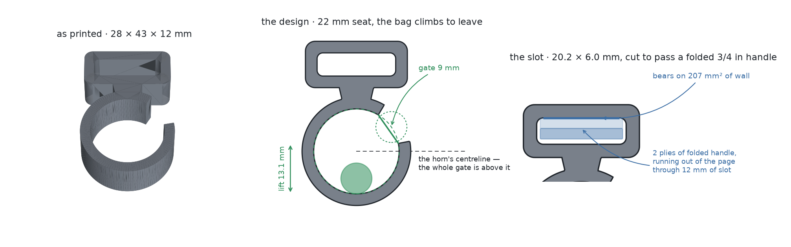
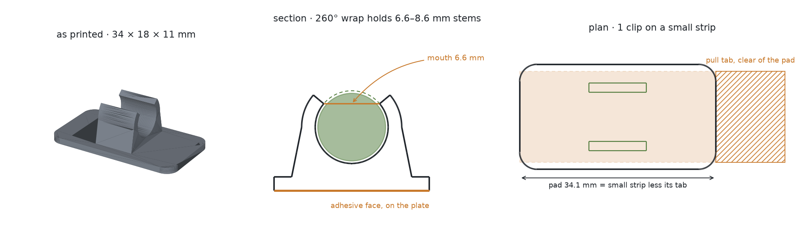
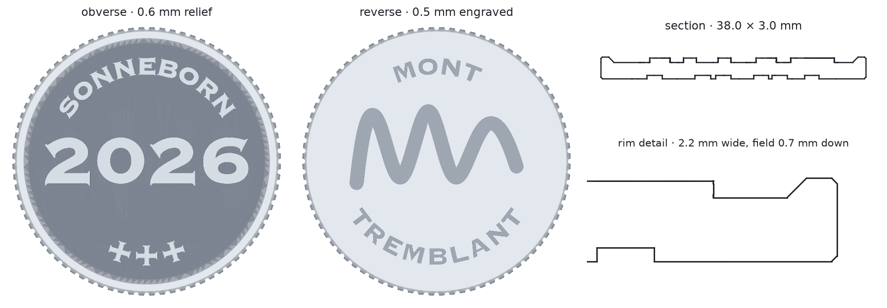
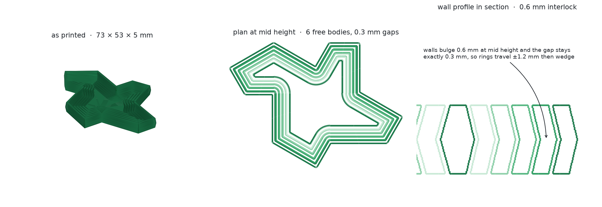

# printables

Parametric 3D-printable models for a Bambu Lab P2S, written in
[build123d](https://build123d.readthedocs.io/) and sliced without opening the
slicer.

Every model here is a Python function from a frozen `Params` dataclass to a
solid. The parameters are the design — the sliders a GUI would expose — and
each one carries a `validate()` that refuses the combinations that are
physically impossible rather than quietly producing a part that cannot print.
The tests assert design intent, not geometry hashes: that a rim is the highest
thing on a coin, that nothing in a clip overhangs more than 45 degrees, that a
mounting pad leaves an adhesive strip's pull tab clear, that the only way out
of a bag hook is above its own centreline.

## What's in it

### Poop bag holder



A doo loop: a slot that goes on the lead's handle, and an open horn the tied
bag drops into. The whole part is one profile extruded once and printed lying
in the plane it was drawn in, so nothing in it overhangs at all — the lead's
slot, which would be a bridge in any other orientation, is a plain vertical
hole — and the bag hangs in the profile's own plane, so its weight runs along
the extrusions rather than across them. That is also why the horn can wrap as
far as it likes: unlike the plant clip's C, nothing about how far it comes
round is a printing question.

Retention is geometry and no moving part. The gate sits entirely above the
horn's centreline, so the bag has to climb 13mm out of the seat before there is
any way out at all — which a walking swing does not do and a hand does without
looking.

```sh
python -m tools.bag_holder --strap standard
python -m tools.bag_holder --set -o out/bag_holders
```

The slot is cut to pass the handle folded, two plies, because that is the only
way onto a lead that does not involve getting past the snap hook. Thread the
handle through and the holder rides free on the lead; pass the rest of the lead
back through the handle first and the same slot is a girth hitch that stays at
your hand. Only the head changes with the lead's width — the horn is identical
on all four in the catalogue — so `--set` costs nothing but the heads.

### Plant clip



An adhesive pad with a C that a vine presses into. Built around a 3M Command
strip rather than a screw, sized for pothos and hoya — roughly 4 to 12mm of
stem — and printed pad-down so the adhesive gets the smooth build-plate face.
The mouth faces away from the wall because that is the only direction that both
prints and installs, and the wrap is capped at 270° because past that the arm
tips lean more than 45° off vertical.

```sh
python -m tools.plant_clip --set --copies 3      # one plate, four sizes, twelve clips
python -m tools.plant_clip --stem 9 --strip medium --count 2
```

A clip holds a band of stem diameters a couple of millimetres wide — from its
mouth, the smallest stem that stays captive, up to its bore, the largest that
fits. `--set` prints the four sizes that tile the range between them.

### Commemorative coin



A disc, a rim, and a mark on each face, from one revolved profile. Marks are
text, an SVG, an arched legend, or a drawn stroke, all specified in fractions
of the field so a test print at 80% is the same coin rather than a differently
proportioned one. The obverse is struck in relief inside a recessed field and
the reverse is engraved into a flat underside, because on an FDM printer only
the top face can carry relief without printing over air.

```sh
python -m tools.coin --obverse 2026 --legend "SONNEBORN" --exergue "+++"
python -m tools.coin --part parts.tremblant_coin --scale 0.8 --nozzle 0.2
```

### Einstein monotile fidget



Nested print-in-place rings following the outline of the
[hat aperiodic monotile](https://arxiv.org/abs/2303.10798) (Smith, Myers,
Kaplan & Goodman-Strauss, 2023), derived from its kite grid in `geom/hat.py`.
The walls bulge at mid height so the rings travel a fixed distance and then
wedge, which is what makes it a fidget rather than a pile of loose rings. Adding
rings turns the same part into a coaster.

## Layout

| | |
|---|---|
| `geom/` | Reusable primitives: the monotile, motifs (text, SVG, legends, strokes), the Command strip and lead webbing catalogues |
| `parts/` | One module per model — `Params`, `validate()`, `build()` — plus modules that ship a specific configured instance |
| `tools/` | Command line for each part, and matplotlib previews that need no GPU |
| `p2s/` | The printer: profiles read from the installed Bambu Studio, what filament is on the shelf, and headless slicing |
| `tests/` | Design intent, asserted against the built solid |

## Slicing

`p2s/profiles.py` reads Bambu Studio's own bundled presets and flattens their
`inherits` chains, so the bed size, nozzle and process the models are checked
against can never drift from what actually slices. `p2s/slicer.py` writes a
project 3MF with a merged machine + process + filament config embedded the way
Bambu's `--export-settings` writes it, then drives the app headlessly for a time
and filament estimate.

One environment quirk: Bambu Studio has to run in the user's GUI session, so it
is launched through `open` rather than by executing the binary. From a sandboxed
process that fails, which is what `tools/p2s-slice.sh` exists to work around.

```sh
python -m tools.plant_clip --set --copies 3 -o out/clips   # .stl, .3mf and .png
~/bin/p2s-slice out/clips.3mf                              # time and grams
```

## Running it

```sh
uv sync
uv run pytest
uv run python -m tools.plant_clip
```

Needs Python 3.12+ and, for anything that writes a 3MF, Bambu Studio installed
at `/Applications/BambuStudio.app`. The STL is written either way — a missing
slicer is a note, not a failure.

## Licence

Split, because code and geometry are not the same thing:

- **Code** — MIT. See [LICENSE](LICENSE).
- **Models** — CC BY-NC-SA 4.0: the designs, the STL/3MF/STEP they generate,
  and objects printed from them. Attribution and share-alike, and not for
  commercial use, which includes selling prints. See
  [LICENSE-MODELS](LICENSE-MODELS).
